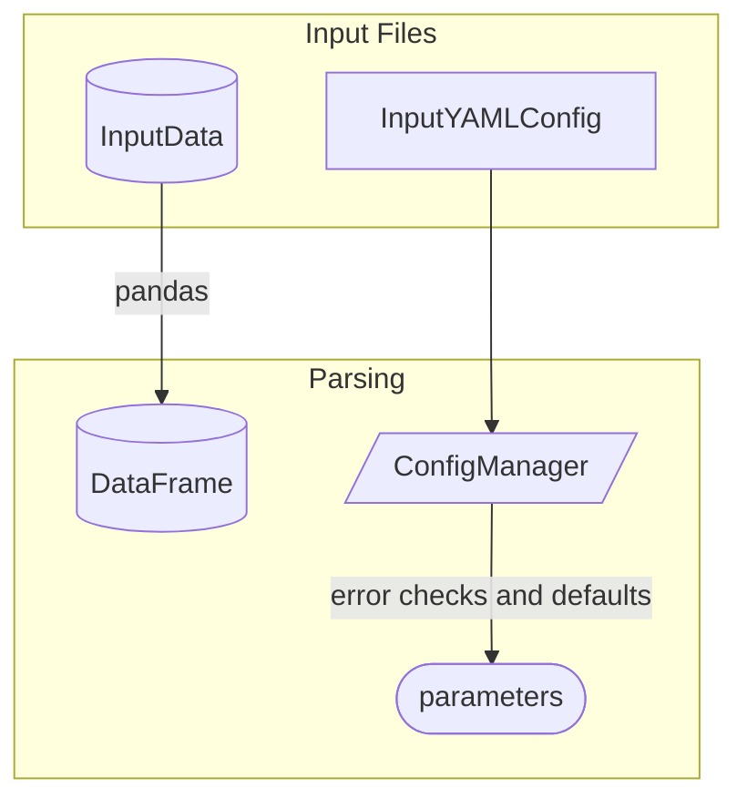
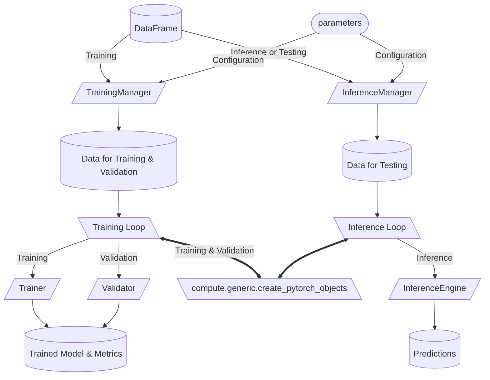

Documentation: start with [index.md](../docs/index.md).

## Related flowcharts

### I/O

```mermaid
flowchart TD
    subgraph Input Files
        InputData[(InputData)] 
        InputYAMLConfig 
    end

    subgraph Parsing
        InputData[(InputData)] -->|pandas| df[(DataFrame)]
        InputYAMLConfig --> ConfigManager[/ConfigManager/] -->|error checks and defaults| parameters([parameters])
    end
```

### Top-Level Parsing

```mermaid
flowchart TD
    df[(DataFrame)] --> |Training| TrainingManager[/TrainingManager/] --> Data_TV[(Data for Training & Validation)] --> Loop_Train[\Training Loop\]
    df --> |Inference or Testing| InferenceManager[/InferenceManager/] --> Data_Test[(Data for Testing)] --> Loop_Inference[\Inference Loop\]
    parameters([parameters]) -->|Configuration| TrainingManager
    parameters([parameters]) -->|Configuration| InferenceManager
    Loop_Train -->|Training| Trainer[/Trainer/] --> Model[(Trained Model & Metrics)]
    Loop_Train -->|Validation| Validator[/Validator/] --> Model
    Loop_Train <==>|Training & Validation| CommonObjects[\compute.generic.create_pytorch_objects\]
    Loop_Inference -->|Inference| InferenceEngine[/InferenceEngine/] --> Predictions[(Predictions)]
    Loop_Inference <==> CommonObjects
```
