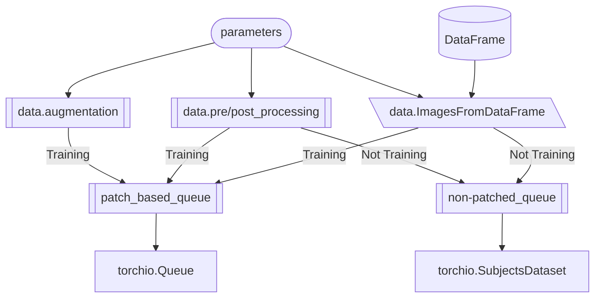

## Related flowcharts

### The `GANDLF.data` Submodule

```mermaid
flowchart TD
    parameters([parameters]) --> ImagesFromDataFrame
    parameters --> data_augmentation[[data.augmentation]]
    parameters --> data_processing[[data.pre/post_processing]]
    df[(DataFrame)] --> ImagesFromDataFrame[\data.ImagesFromDataFrame\]
    data_augmentation -->|Training| tioq[[patch_based_queue]] --> torchio.Queue
    data_processing -->|Training| tioq
    data_processing -->|Not Training| tiosd[[non-patched_queue]] --> torchio.SubjectsDataset
    ImagesFromDataFrame -->|Training| tioq
    ImagesFromDataFrame -->|Not Training| tiosd
```
