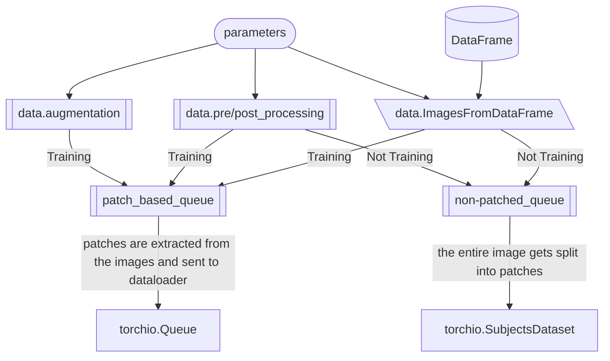

## Related flowcharts

### The `GANDLF.data` Submodule

#### Notes 

- `patch_based_queue` above is a [`torchio.Queue`](https://torchio.readthedocs.io/patches/patch_training.html#torchio.data.Queue) object that is used to extract patches from the images and send them to the training dataloader. The number of patches to extract from each image is determined by the `q_samples_per_volume` parameter in the `parameters` object.
- `non-patched_queue` above is a [`torchio.SubjectsDataset`](https://torchio.readthedocs.io/data/dataset.html#torchio.data.SubjectsDataset) object that is used to split the **entire** image into patches and send them to the testing/validation dataloader. This ensures that the entire image is used for inference and generate a full-image prediction.
  - The patches (along with their locations) for validation/inference are extracted using [`torchio.GridSampler`](https://torchio.readthedocs.io/patches/patch_inference.html#gridsampler).
  - The predictions from different patches are combined using [`torchio.GridAggregator`](https://torchio.readthedocs.io/patches/patch_inference.html#gridaggregator).