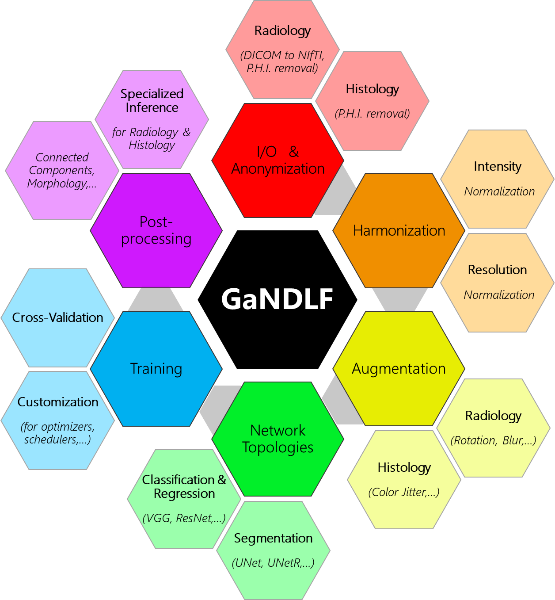

# GaNDLF

<p align="center">
  <a href="https://github.com/mlcommons/GaNDLF/actions/workflows/python-test.yml" alt="Build Status"></a>
  <a href="https://github.com/mlcommons/GaNDLF/actions/workflows/codeql-analysis.yml" alt="Code Analysis"></a>
  <a href="https://hub.docker.com/repository/docker/cbica/gandlf" alt="Docker CI"></a>
  <a href="https://codecov.io/gh/mlcommons/GaNDLF" alt="Code Coverage"></a>
  <a href="https://app.codacy.com/gh/mlcommons/GaNDLF?utm_source=github.com&utm_medium=referral&utm_content=mlcommons/GaNDLF&utm_campaign=Badge_Grade_Settings"></a><br>
  <a href="https://anaconda.org/conda-forge/gandlf" alt="Install"></a>
  <a href="https://github.com/mlcommons/GaNDLF/discussions" alt="Issues"></a>
  <a href="https://arxiv.org/abs/2103.01006" alt="Citation"></a>
  <a href="https://github.com/psf/black"></a>
</p>

The **G**ener**a**lly **N**uanced **D**eep **L**earning **F**ramework for segmentation, regression and classification.

<p align="center">
    
</p>

## Why use this?

- Supports multiple
  - Deep Learning model architectures
  - Data dimensions (2D/3D)
  - Channels/images/sequences 
  - Prediction classes
  - Domain modalities (i.e., Radiology Scans and Digitized Histopathology Tissue Sections)
  - Problem types (segmentation, regression, classification)
  - Multi-GPU (on same machine) training
- Built-in 
  - Nested cross-validation (and related combined statistics)
  - Support for parallel HPC-based computing
  - Support for training check-pointing
  - Support for [Automatic mixed precision](https://pytorch.org/blog/accelerating-training-on-nvidia-gpus-with-pytorch-automatic-mixed-precision/)
- Robust data augmentation, courtesy of [TorchIO](https://github.com/fepegar/torchio/)  
- Handles imbalanced classes (e.g., very small tumor in large organ)
- Leverages robust open source software
- No need to write any code to generate robust models

## Citation

Please cite the following article for GaNDLF ([full PDF](https://arxiv.org/abs/2103.01006)):

```
@misc{pati2021gandlf,
      title={GaNDLF: A Generally Nuanced Deep Learning Framework for Scalable End-to-End Clinical Workflows in Medical Imaging}, 
      author={Sarthak Pati and Siddhesh P. Thakur and Megh Bhalerao and Spyridon Thermos and Ujjwal Baid and Karol Gotkowski and Camila Gonzalez and Orhun Guley and Ibrahim Ethem Hamamci and Sezgin Er and Caleb Grenko and Brandon Edwards and Micah Sheller and Jose Agraz and Bhakti Baheti and Vishnu Bashyam and Parth Sharma and Babak Haghighi and Aimilia Gastounioti and Mark Bergman and Anirban Mukhopadhyay and Sotirios A. Tsaftaris and Bjoern Menze and Despina Kontos and Christos Davatzikos and Spyridon Bakas},
      year={2021},
      eprint={2103.01006},
      archivePrefix={arXiv},
      primaryClass={cs.LG}
}
```

## Documentation

GaNDLF has extensive documentation and it is arranged in the following manner:

- [Home](https://mlcommons.github.io/GaNDLF/)
- [Installation](https://mlcommons.github.io/GaNDLF/setup)
- [Usage](https://mlcommons.github.io/GaNDLF/usage)
- [Extension](https://mlcommons.github.io/GaNDLF/extending)
- [Frequently Asked Questions](https://mlcommons.github.io/GaNDLF/faq)
- [Acknowledgements](https://mlcommons.github.io/GaNDLF/acknowledgements)

## Contributing

Please see the [contributing guide](./CONTRIBUTING.md) for more information.

### Weekly Meeting

The GaNDLF development team hosts a weekly meeting to discuss feature additions, issues, and general future directions. If you are interested to join, please <a href="mailto:gandlf@mlcommons.org?subject=Meeting Request">send us an email</a>!

## Disclaimer
- The software has been designed for research purposes only and has neither been reviewed nor approved for clinical use by the Food and Drug Administration (FDA) or by any other federal/state agency.
- This code (excluding dependent libraries) is governed by [the Apache License, Version 2.0](https://www.apache.org/licenses/LICENSE-2.0.txt) provided in the [LICENSE file](./LICENSE) unless otherwise specified.

## Contact
For more information or any support, please post on the [Discussions](https://github.com/mlcommons/GaNDLF/discussions) section.
