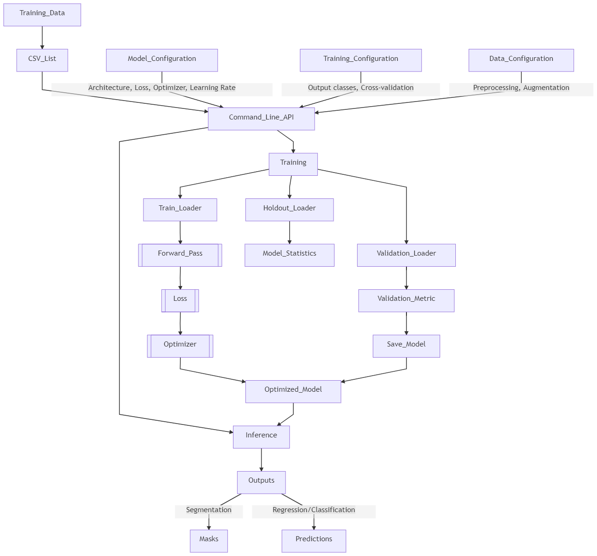
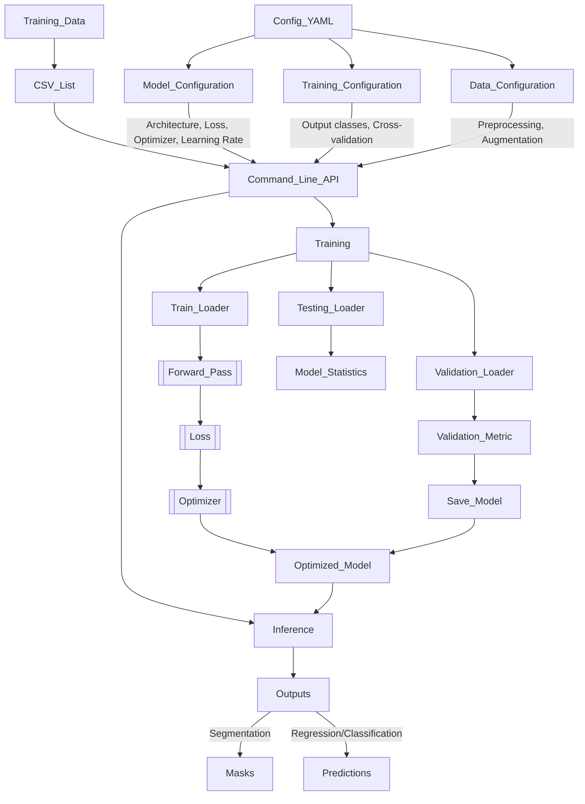

The website for GaNDLF; start with [index.md](./index.md).

## Flowchart

### Code 

Visualize using https://mermaid-js.github.io/mermaid-live-editor/

```mermaid
graph TD;
    Training_Data-->CSV_List;
    CSV_List-->Command_Line_API;
    Config_YAML-->Model_Configuration
    Config_YAML-->Training_Configuration
    Config_YAML-->Data_Configuration
    Model_Configuration-- Architecture, Loss, Optimizer, Learning Rate -->Command_Line_API;
    Training_Configuration-- Output classes, Cross-validation -->Command_Line_API;
    Data_Configuration-- Preprocessing, Augmentation -->Command_Line_API;
    Command_Line_API-->Inference;
    Command_Line_API-->Training;
    Inference-->Outputs;
    Outputs--Segmentation-->Masks;
    Outputs--Regression/Classification-->Predictions;
    Training-->Train_Loader;
    Training-->Validation_Loader;
    Training-->Testing_Loader;
    Train_Loader-->FWD[[Forward_Pass]];
    FWD[[Forward_Pass]]-->Loss[[Loss]];
    Loss[[Loss]]-->Optimizer[[Optimizer]];
    Validation_Loader-->Validation_Metric;
    Validation_Metric-->Save_Model;
    Testing_Loader-->Model_Statistics;
    Optimizer[[Optimizer]]-->Optimized_Model;
    Save_Model-->Optimized_Model;
    Optimized_Model-->Inference;
```
