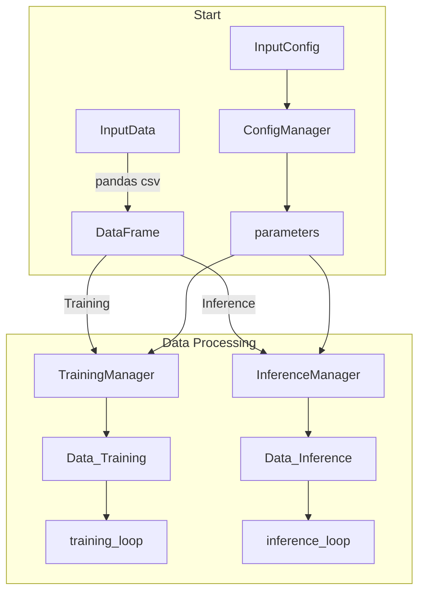
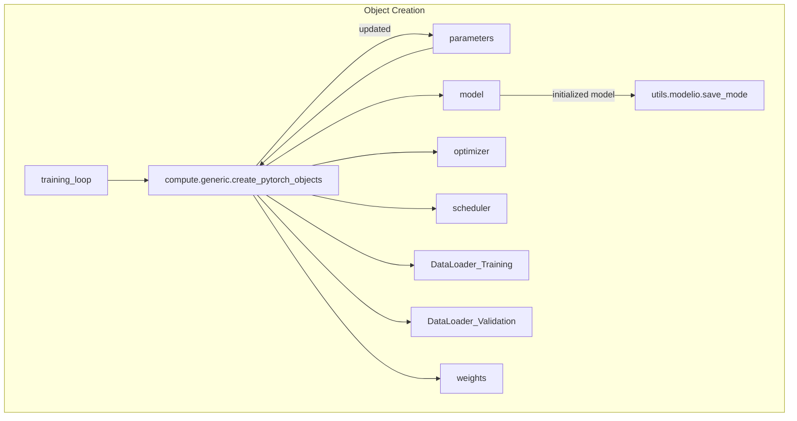
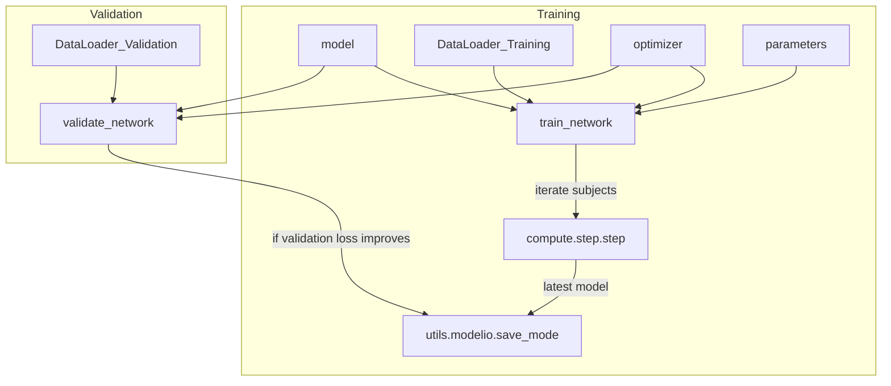

## Internal Connections of GaNDLF

### I/O and Top-Level Parsing

```mermaid
flowchart TD
    subgraph Input [Start]
        InputData -->|pandas csv| DataFrame
        InputConfig --> ConfigManager --> parameters
    end

    subgraph Data Processing
        DataFrame --> |Training| TrainingManager --> Data_Training --> training_loop
        DataFrame --> |Inference| InferenceManager --> Data_Inference --> inference_loop
        parameters --> TrainingManager
        parameters --> InferenceManager
    end
```

### Creating Compute Objects

```mermaid
flowchart 
    subgraph Object Creation
        training_loop --> compute.generic.create_pytorch_objects
        parameters --> compute.generic.create_pytorch_objects
        compute.generic.create_pytorch_objects --> model
        compute.generic.create_pytorch_objects --> optimizer
        compute.generic.create_pytorch_objects --> scheduler
        compute.generic.create_pytorch_objects --> DataLoader_Training
        compute.generic.create_pytorch_objects --> DataLoader_Validation
        compute.generic.create_pytorch_objects --> weights
        compute.generic.create_pytorch_objects -->|updated| parameters
        model -->|initialized model| utils.modelio.save_mode
    end
```

### Training and Validation

```mermaid
flowchart TD
    subgraph Training
        model --> train_network
        DataLoader_Training --> train_network
        optimizer --> train_network
        parameters --> train_network
        train_network -->|iterate subjects| compute.step.step
        compute.step.step -->|latest model| utils.modelio.save_mode
    end

    subgraph Validation
        model --> validate_network
        DataLoader_Validation --> validate_network
        optimizer --> validate_network
        validate_network -->|if validation loss improves| utils.modelio.save_mode
    end

```
