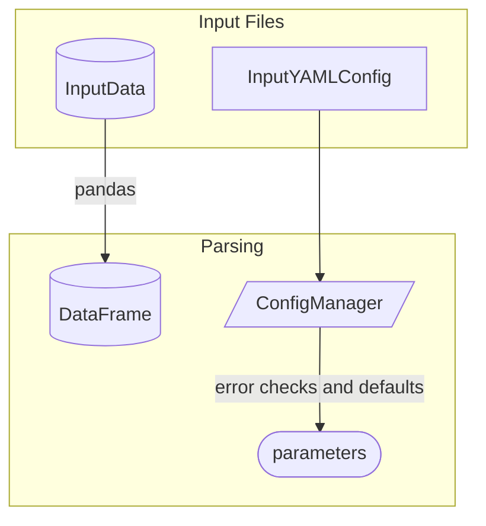
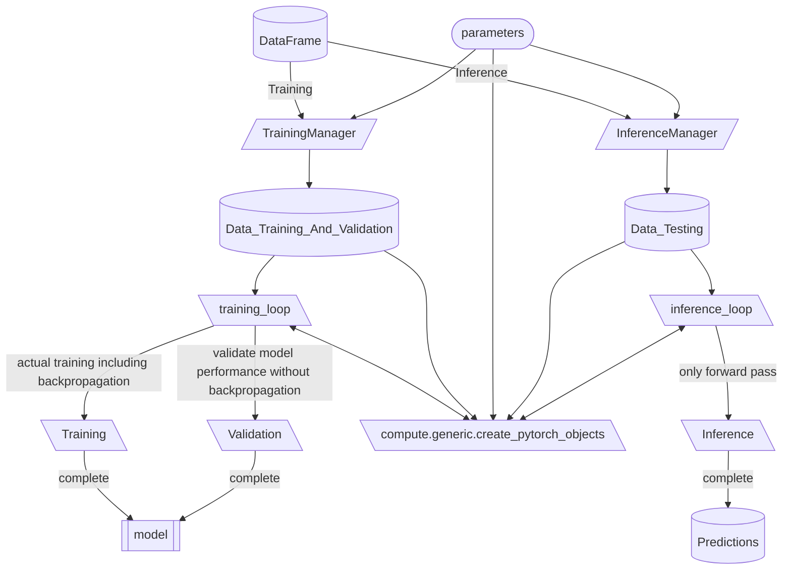
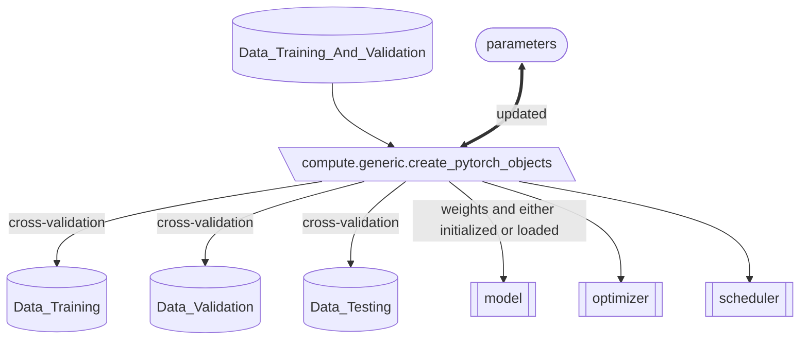
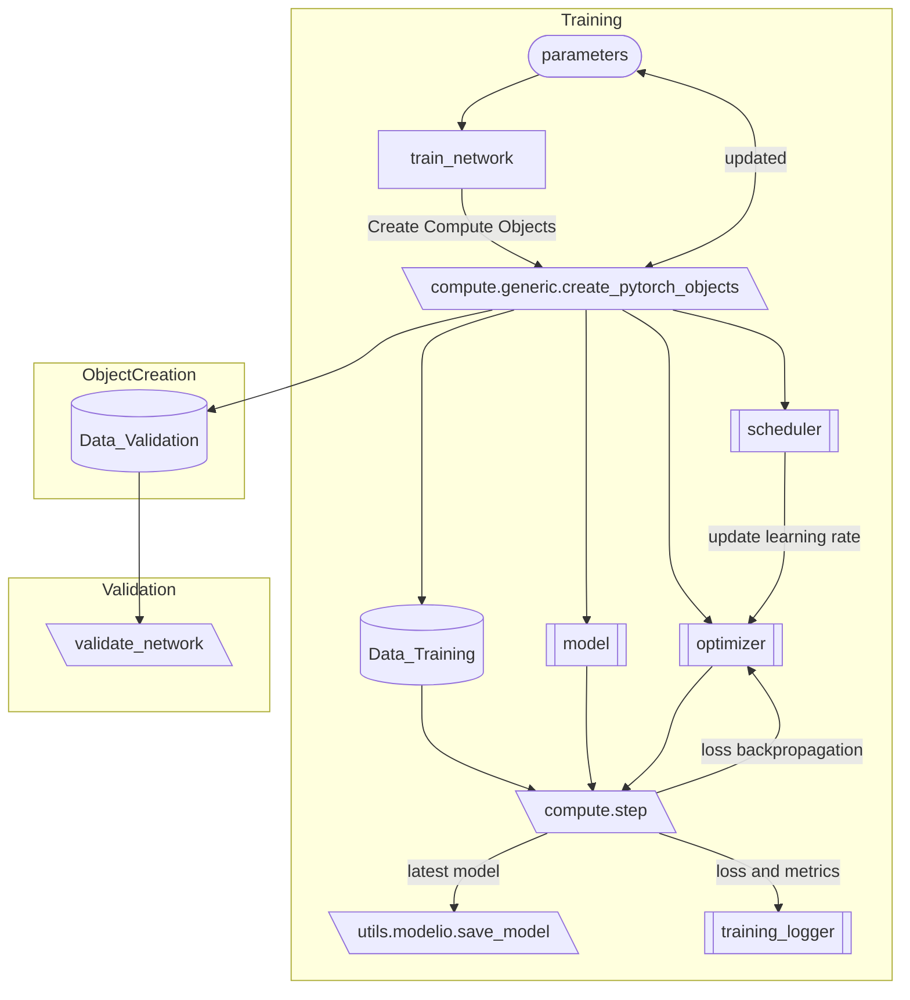
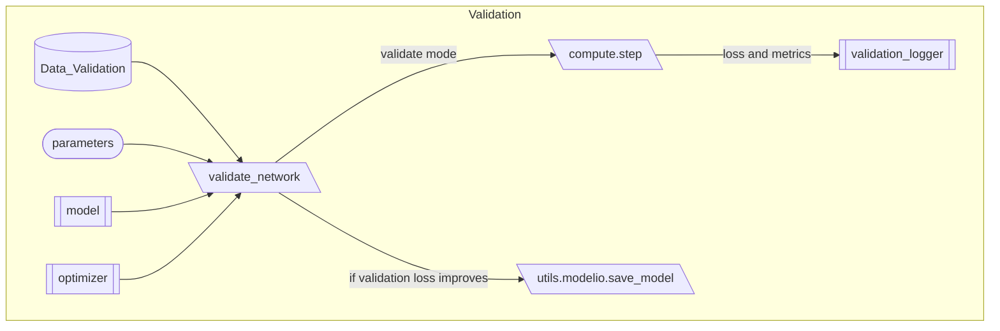
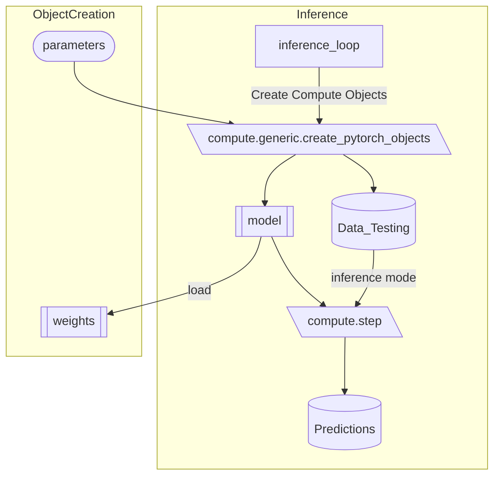
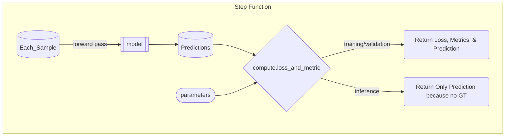

## Internal Connections of GaNDLF

### I/O

```mermaid
flowchart TD
    subgraph Input Files
        InputData[(InputData)] 
        InputYAMLConfig 
    end

    subgraph Parsing
        InputData[(InputData)] -->|pandas| df[(DataFrame)]
        InputYAMLConfig --> ConfigManager[/ConfigManager/] -->|error checks and defaults| parameters([parameters])
    end
```

### Top-Level Parsing

```mermaid
flowchart TD
    df[(DataFrame)] --> |Training| TrainingManager[/TrainingManager/] --> Data_Training_And_Validation[(Data_Training_And_Validation)] --> training_loop[\training_loop\]
    df --> |Inference| InferenceManager[/InferenceManager/] --> Data_Testing[(Data_Testing)] --> inference_loop[\inference_loop\]
    parameters([parameters]) --> TrainingManager
    parameters --> InferenceManager
    training_loop -->|actual training including backpropagation| Training[\Training\]
    training_loop -->|validate model performance without backpropagation| Validation[\Validation\]
    training_loop <--> create_pytorch_objects[\compute.generic.create_pytorch_objects\]
    Data_Training_And_Validation --> create_pytorch_objects
    parameters --> create_pytorch_objects
    Data_Testing --> create_pytorch_objects
    inference_loop -->|only forward pass| Inference[\Inference\]
    inference_loop <--> create_pytorch_objects
    Training -->|complete| model[[model]]
    Validation -->|complete| model
    Inference -->|complete| Predictions[(Predictions)]
```

### Creating PyTorch Compute Objects

```mermaid
flowchart TD
    Data_Training_And_Validation[(Data_Training_And_Validation)] --> create_pytorch_objects[\compute.generic.create_pytorch_objects\]
    parameters([parameters]) <==>|updated| create_pytorch_objects
    create_pytorch_objects -->|cross-validation| Data_Training[(Data_Training)]
    create_pytorch_objects -->|cross-validation| Data_Validation[(Data_Validation)] 
    create_pytorch_objects -->|cross-validation| Data_Testing[(Data_Testing)]
    create_pytorch_objects -->|weights and either initialized or loaded| model[[model]]
    create_pytorch_objects --> optimizer[[optimizer]]
    create_pytorch_objects --> scheduler[[scheduler]]
```

### Training

```mermaid
flowchart TD
    subgraph Training
        parameters([parameters]) --> train_network
        train_network -->|Create Compute Objects| create_pytorch_objects[\compute.generic.create_pytorch_objects\]
        Data_Training[(Data_Training)] --> step[\compute.step\]
        model[[model]] --> step
        optimizer[[optimizer]] --> step
        step -->|loss backpropagation| optimizer
        create_pytorch_objects --> optimizer[[optimizer]]
        create_pytorch_objects --> scheduler[[scheduler]]
        scheduler -->|update learning rate| optimizer
        step -->|latest model| save_model[\utils.modelio.save_model\]
        step -->|loss and metrics| log_metrics[[training_logger]]
    end
     
    subgraph ObjectCreation
        parameters([parameters]) <-->|updated| create_pytorch_objects
        create_pytorch_objects --> Data_Training[(Data_Training)]
        create_pytorch_objects --> Data_Validation[(Data_Validation)] 
        create_pytorch_objects --> model[[model]]
    end
     
    subgraph Validation
        Data_Validation[(Data_Validation)] --> validate_network[\validate_network\]
    end
```

### Validation

```mermaid
flowchart TD
    subgraph Validation
        Data_Validation[(Data_Validation)] --> validate_network[\validate_network\]
        parameters([parameters]) --> validate_network
        model[[model]] --> validate_network
        optimizer[[optimizer]] --> validate_network
        validate_network -->|validate mode| step[\compute.step\]
        validate_network -->|if validation loss improves| save_model[\utils.modelio.save_model\]
        step -->|loss and metrics| log_metrics[[validation_logger]]
    end
```

### Inference

```mermaid
flowchart
    subgraph Inference
        inference_loop -->|Create Compute Objects| create_pytorch_objects[\compute.generic.create_pytorch_objects\]
        model[[model]] --> step
        DataLoader_Testing[(DataLoader_Testing)] -->|inference mode| step[\compute.step\]
        step --> Predictions[(Predictions)]
    end
     
    subgraph ObjectCreation
        parameters([parameters]) --> create_pytorch_objects
        create_pytorch_objects --> DataLoader_Testing[(Data_Testing)]
        create_pytorch_objects --> model[[model]]
        model -->|load| weights[[weights]]
    end
```

### The Actual `compute.step` Routine

```mermaid
flowchart TD
    subgraph Step Function
        Each_Sample[(Each_Sample)] -->|forward pass| model[[model]]
        model --> Predictions[(Predictions)]
        Predictions[(Predictions)] --> type{compute.loss_and_metric}
        parameters([parameters]) --> type
        type -->|training/validation| loss(Return Loss, Metrics, & Prediction)
        type -->|inference| inferences_metrics(Return Only Prediction because no GT)
    end
```
