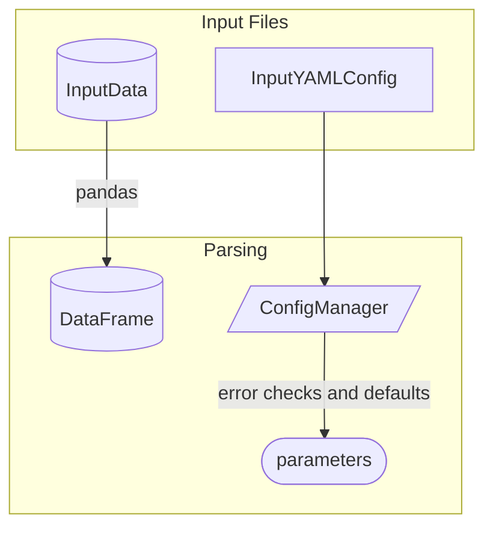

## Internal Connections of GaNDLF

- The flowcharts have been created using the [mermaid](https://mermaid-js.github.io/mermaid/#/) library. Documentation for the flowchart section can be found [here](https://mermaid.js.org/syntax/flowchart.html).

### I/O

### Top-Level Parsing

### Creating PyTorch Compute Objects using `GANDLF.compute.generic.create_pytorch_objects`

### Training

### Validation

### Inference

### The Actual `compute.step` Routine

### The `GANDLF.data` Submodule

